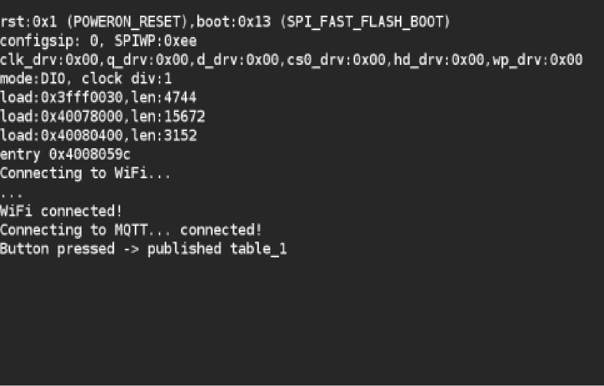
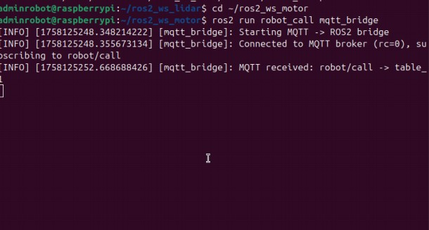

# ESP32 → Raspberry Pi ROS2 Communication (MQTT)

[](https://docs.ros.org/en/jazzy/)
[](https://www.espressif.com/en/products/socs/esp32)

---

## 🚀 Overview

This project enables communication between an **ESP32** and a **Raspberry Pi 5 running ROS2** using **MQTT**.  

Key features:

- 🔹 ESP32 publishes button events to MQTT  
- 🔹 ROS2 nodes subscribe to MQTT topics  
- 🔹 `call_manager.py` handles robot requests  
- 🔹 `mqtt_bridge.py` bridges MQTT messages to ROS2 topics

---

## 🗂️ Project Structure

```
bouton/
├── robot_call/           # ROS2 package for Pi5
│   ├── call_manager.py
│   └── mqtt_bridge.py
├── bouton.ino            # ESP32 Arduino code
├── media/                # Demo images
│   ├── esp32_send.jpg
│   └── pi5_receive.jpg
├── README.md             # This file
└── .gitignore
```

---

## ⚙️ Prerequisites

- Raspberry Pi 5 with Ubuntu 24.04  
- ROS2 Jazzy installed  
- ESP32 board with Arduino IDE  
- MQTT broker ( Mosquitto) running on Raspberry Pi  
- Python package `paho-mqtt` for ROS2 nodes  

---

## 🛠️ Setup Instructions

1. **Clone the repository:**
```bash
git clone https://github.com/<Manar-Daghsni>/ESP32-and-ROS2-MQTT.git
cd ESP32-and-ROS2-MQTT
```

2. **Install Python dependencies for ROS2:**
```bash
pip install paho-mqtt
```

3. **Upload Arduino code** to ESP32 (`bouton.ino`) via Arduino IDE.  

4. **Launch ROS2 nodes:**
```bash
ros2 run robot_call mqtt_bridge.py
ros2 run robot_call call_manager.py
```

---

## ▶️ How it Works

1. Press a button on ESP32  
2. ESP32 publishes an MQTT message  
3. `mqtt_bridge.py` receives the message and republishes it as a ROS2 topic  
4. `call_manager.py` handles the event and triggers the robot action

---

## 🖼️ Visual Demo

### ESP32 sending MQTT message


### Raspberry Pi 5 receiving ROS2 message


---

## 💡 Notes

- ROS2 topic names and MQTT topics can be configured in the bridge script  
- More buttons or events can be added by modifying the Arduino sketch and ROS2 nodes  
- Designed to scale to multiple robots or sensors

---

## 🔗 References

- [ROS2 Jazzy Documentation](https://docs.ros.org/en/jazzy/)  
- [ESP32 Arduino](https://www.espressif.com/en/products/socs/esp32)  
- [MQTT Python Paho](https://pypi.org/project/paho-mqtt/)
  
---

## 📧 Contact
**Manar Daghsni**  
📧 manardaghsni@gmail.com  
🔗 https://linkedin.com/in/daghsni-manar  

